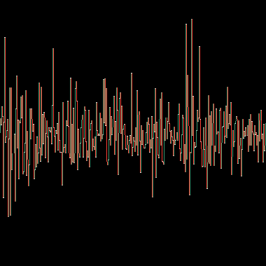
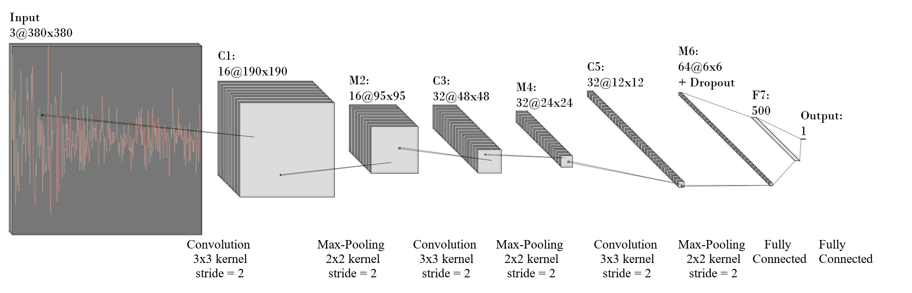
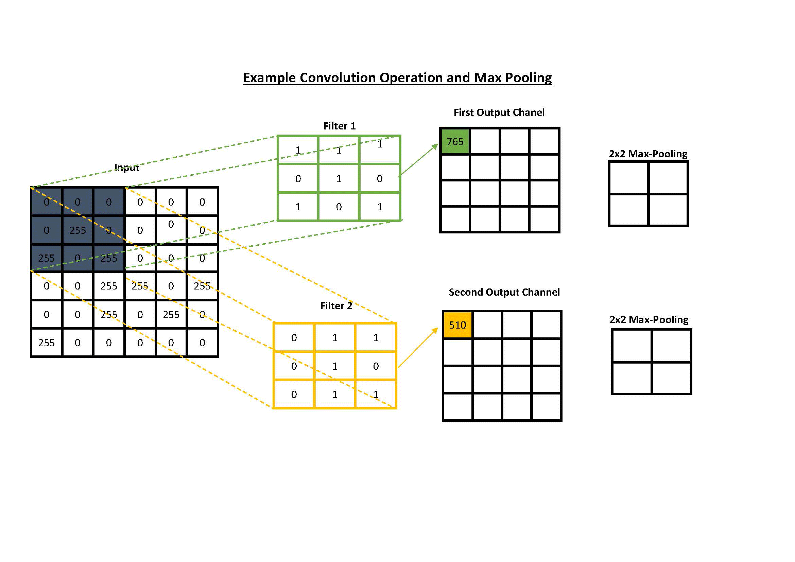
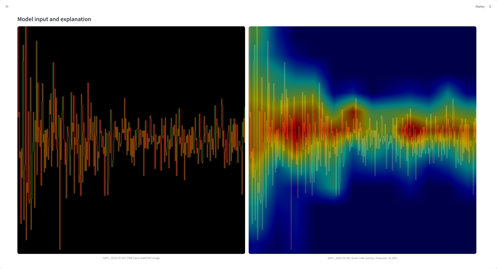

# Image-Based CNN Volatility Forecasting

### Interactive demonstration of CNN-based next-day realized volatility forecasting using intraday waterfall images and Grad-CAM explainability.

[](https://volatility-forecasting.streamlit.app)

---

# Live Demo

👉 https://volatility-forecasting.streamlit.app

---

# Overview

This project demonstrates an end-to-end deep learning workflow for forecasting **next-day realized stock market volatility** from **1-minute intraday price data**.

Rather than modelling financial time series directly, each trading day is transformed into a structured **waterfall image**, allowing a **Convolutional Neural Network (CNN)** to identify visual patterns associated with future market volatility.

The application provides an interactive Streamlit interface where users can

- download recent intraday market data,
- automatically fall back to demonstration data if live data is unavailable,
- generate waterfall images,
- predict next-day realized volatility,
- inspect Grad-CAM explanations,
- compare forecasts with realized volatility.

> **Note**
>
> This repository implements the **daily CNN component** of the methodology presented in the accompanying research paper. The original publication combines CNN forecasts with HAR models (CNN–HAR fusion). This repository focuses exclusively on the image-based CNN model and provides an interactive demonstration of its prediction and explainability workflow.

---

# Interactive Dashboard

The application allows users to generate volatility forecasts directly from recent intraday market data through a simple web interface.

Features include

- live market data download
- automatic fallback to demonstration data
- next-day volatility prediction
- historical forecast evaluation
- Grad-CAM explainability


---

# End-to-End Pipeline

```text
          Live Yahoo Finance
                  │
       (automatic fallback)
                  ▼
     Stored Demonstration Dataset
                  │
                  ▼
     Intraday Data Preprocessing
                  │
                  ▼
     1-minute Log Return Calculation
                  │
                  ▼
     380×380 Waterfall Image
                  │
                  ▼
     Convolutional Neural Network
                  │
                  ▼
     Next-Day Volatility Forecast
                  │
                  ▼
     Grad-CAM Explainability
```

---

# Scientific Motivation

Financial markets exhibit complex dynamics including

- volatility clustering
- persistence
- nonlinear relationships
- asymmetric market reactions

Instead of modelling raw return series directly, this project transforms intraday returns into structured visual representations.

The resulting waterfall images preserve temporal ordering while enabling convolutional neural networks to learn informative spatial patterns that are difficult to capture using traditional statistical approaches.

---

# From Time Series to Images

Each trading day is converted into a **380×380 RGB waterfall image**.

Positive returns are shown in green, negative returns in red.

The image preserves

- temporal ordering
- return magnitude
- return direction
- local volatility clustering

and serves as the input to the convolutional neural network.



---

# CNN Architecture

The waterfall image is processed by the daily CNN used for next-day volatility forecasting.

The model extracts increasingly abstract visual features through convolutional and max-pooling layers before producing the volatility prediction.



---

# How CNNs Learn

The animation below illustrates the general concepts of convolution and max-pooling used in convolutional neural networks.

Convolutional filters learn local visual patterns while max-pooling compresses feature maps and retains the most informative features.



---

# Explainable AI

Understanding **why** a model makes a prediction is especially important in financial applications.

Grad-CAM highlights the regions of the waterfall image that contributed most strongly to the predicted volatility, making the CNN considerably more interpretable than a traditional black-box model.



---

# Example Forecast

The dashboard visualizes historical forecasts together with realized volatility and displays the next-day prediction.


---

# Robustness

To ensure that the public demonstration remains operational, the application automatically switches to a stored demonstration dataset whenever live Yahoo Finance downloads are temporarily unavailable.

| Situation | Behaviour |
|-----------|-----------|
| Yahoo Finance available | Uses live 1-minute market data |
| Yahoo Finance unavailable | Automatically loads demonstration data |
| CNN model | Identical |
| Image generation | Identical |
| Grad-CAM | Fully available |

---

# Research Background

This application demonstrates the **daily CNN component** of the methodology presented in

**Betz, N., Heil, T. L. A., & Peter, F. (2023)**

**Image-Based Deep Learning for Volatility Forecasting: A CNN–HAR Fusion Approach Using Intraday Returns**

SSRN:
https://ssrn.com/abstract=4584108

DOI:
http://dx.doi.org/10.2139/ssrn.4584108

---

# Technology Stack

- Python
- TensorFlow / Keras
- Streamlit
- NumPy
- Pandas
- Matplotlib
- OpenCV
- FastAPI
- Docker

---

# Key Features

- End-to-end CNN inference pipeline
- Image-based financial time series modelling
- Explainable AI using Grad-CAM
- Interactive Streamlit dashboard
- Automatic fallback to demonstration data
- Docker deployment
- Research-inspired methodology

---

# Run Locally

```bash
streamlit run streamlit_app.py
```

---

# Docker

```bash
docker build -t volatility-streamlit .

docker run -d --rm -p 8501:8501 volatility-streamlit
```

Open

```
http://localhost:8501
```

---

# Repository Structure

```text
volatility-forecasting/
│
├── streamlit_app.py
├── pipeline.py
├── create_sample_data.py
├── sample_data/
├── model/
├── images/
├── requirements.txt
├── Dockerfile
└── README.md
```

---

# Future Work

Potential extensions include

- CNN–HAR fusion
- transformer-based forecasting
- probabilistic volatility prediction
- multi-asset forecasting
- real-time streaming market data

---

# Author

**Franziska Peter**

Professor of Econometrics, Statistics and Data Science (former)

Research interests include

- Financial econometrics
- Volatility forecasting
- Machine learning
- Explainable AI
- Deep learning for financial markets