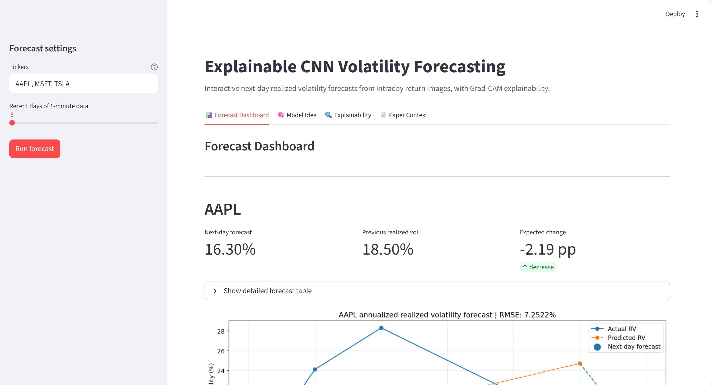
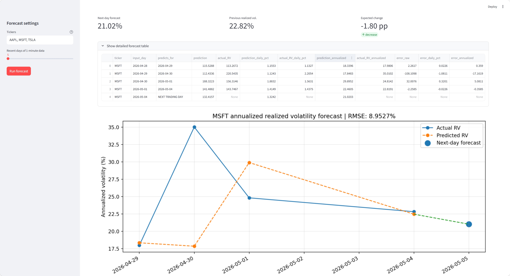

## Live Demo
https://volatility-forecasting.streamlit.app
This app forecasts next-day volatility using a CNN trained on intraday data and provides explainability via Grad-CAM.


# Explainable CNN Volatility Forecasting

This project implements a deep learning approach to forecasting next-day realized volatility using intraday stock data.

The model transforms intraday returns into image representations and applies a Convolutional Neural Network (CNN) combined with Grad-CAM explainability.

---

## Features
- Next-day volatility forecasting  
- CNN-based deep learning model  
- Image representation of intraday returns  
- Explainable AI using Grad-CAM  
- Interactive Streamlit dashboard  
- Dockerized application  

---

## Method Overview

1. Download 1-minute intraday data via Yahoo Finance  
2. Compute log returns  
3. Convert returns into waterfall images (380×380 RGB)  
4. Feed images into a trained CNN  
5. Predict next-day realized volatility  
6. Use Grad-CAM to highlight important regions  

---

## Example Output

- Forecast dashboard with multiple stocks  
- Actual vs predicted volatility plots  
- CNN input visualization  
- Grad-CAM explanation overlays  

---

## Demo

### Dashboard



### Forecast



### Grad-CAM Explanation


---

## Run locally (Streamlit)

streamlit run streamlit_app.py

---

## Run with Docker

```markdown
Make sure Docker is installed and running on your system.

### 1. Build the image

```bash
docker build -t volatility-streamlit .
```

### 2. Run the container

```bash
docker run -d --rm -p 8501:8501 --name volatility-app volatility-streamlit
```

### 3. Open in browser

http://localhost:8501

### 4. Stop the app

```bash
docker stop volatility-app
```


---

## Project Structure

volatility-forecasting/
│
├── streamlit_app.py
├── pipeline.py
├── main.py
├── requirements.txt
├── Dockerfile
├── README.md
│
├── model/
│   └── trained_CNN.keras

---

## Explainability (Grad-CAM)

Grad-CAM highlights which regions of the input image influence the volatility prediction.

This helps interpret:

- volatility clustering  
- asymmetric return effects  
- intraday dynamics  

---

## Paper Reference

Betz, Niklas; Heil, Thomas L.A.; Peter, Franziska (2023)  
Image-Based Deep Learning for Volatility Forecasting: A CNN–HAR Fusion Approach Using Intraday Returns  

https://ssrn.com/abstract=4584108  
http://dx.doi.org/10.2139/ssrn.4584108  

---

## Tech Stack

- Python  
- TensorFlow / Keras  
- Pandas / NumPy  
- Matplotlib / OpenCV  
- Streamlit  
- FastAPI (optional backend)  
- Docker  

---

## Purpose

This project demonstrates an end-to-end machine learning pipeline, including:

- data processing  
- model inference  
- explainability  
- UI development  
- containerized deployment  

---

## Author

Franziska Peter
